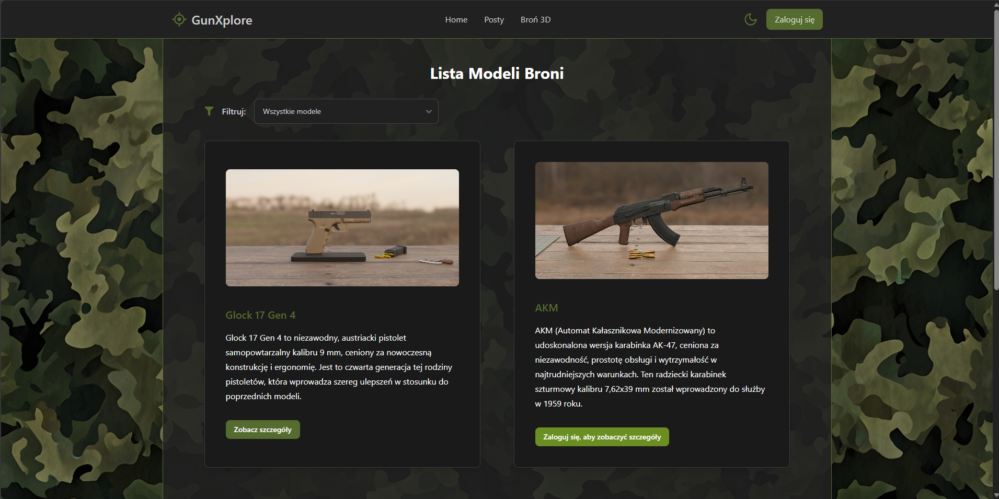

# Social Platform for Military Enthusiasts with Educational 3D Weapon Module

[Polish version (Wersja polska)](README_PL.md)

> **Note:** This application is developed in Polish language. All screenshots, videos, and user interface elements shown in this documentation are displayed in Polish. The source code is not publicly available as this project was developed as an engineering thesis for university studies.

## Table of Contents

1. [Project Description](#project-description)
2. [Technologies](#technologies)
3. [Platform Overview](#platform-overview)
4. [Step-by-Step User Experience](#step-by-step-user-experience)
5. [Social Features](#social-features)
6. [Educational Weapon Module](#educational-weapon-module)
7. [Role-Based Features](#role-based-features)
8. [Responsiveness and Themes](#responsiveness-and-themes)
9. [Visual Materials](#visual-materials)
10. [Contact Information](#contact-information)

## Project Description

The goal of this project was to create a REST API web application that combines social functionalities with an interactive educational module featuring 3D models for military enthusiasts. The backend is built on Laravel 11 with Laravel Sanctum authentication, while the frontend is developed in React with TypeScript, utilizing React Three Fiber for 3D model rendering and Tailwind CSS with DaisyUI for styling.

The application consists of two key modules:
- **Educational Module** enables interaction with realistic 3D weapon models that can be viewed, animated, and explored by clicking individual parts to see their function and description. The system also includes detailed technical data, weapon history, and maintenance schemes.
- **Social Module** utilizes Laravel Gates and Policies mechanisms for user permission management. It offers registration, login, likes, commenting, following, and interaction notifications. The application also provides private chat functionality between users.

During project implementation, the author faced challenges related to 3D model optimization for browser performance, user interaction synchronization, and integration of notification and chat systems. The project addresses the growing interest in military topics, offering a modern educational tool integrated with social features.

## Technologies

### Backend
- 🖥️ **Language**: PHP 8.2.4
- 🛠️ **Framework**: Laravel 11
- 🔒 **Authentication**: Laravel Sanctum
- 💾 **Database**: MySQL/MariaDB 10.4.28
- 🔑 **Authorization**: Laravel Gates & Policies

### Frontend
- ⚛️ **Framework**: React with TypeScript
- 🎮 **3D Rendering**: React Three Fiber
- 🎨 **Styling**: Tailwind CSS, DaisyUI and FlowBite

### 3D Modeling
- 🧊 **Modeling**: Blender
- 🖌️ **Textures**: Custom Diffuse, Normal and Roughness maps
- 📦 **Export**: GLB format

## Platform Overview

> **Language Note:** All interface elements shown below are in Polish language.

### Homepage for Different User Types

  
  
   
  <em>Homepage: view for logged out user (left) and logged in user (right)</em>

Logged out users have limited access to system functionality, including only browsing public 3D models and the 30 most popular posts of the week, while logged in users have full access to all social and educational platform features.

### Main Platform Modules

  
  
   
  <em>Posts view for logged out user (left) and logged in user (right)</em>

  
  
   
  <em>3D models view for logged out user (left) and logged in user (right)</em>

The platform consists of two main modules:
- **Social Module** - enables posting, commenting, liking and interaction with other users. For logged out users, only the 30 most popular posts of the week are available, while logged in users have full access to all content with filtering options.
- **Educational Module** - provides interactive 3D weapon models with detailed descriptions, animations and technical data. Logged out users see only public models, while logged in users have access to all models except drafts.

## Step-by-Step User Experience

### 1. Registration and Login

  
  
   
  <em>Registration process (left) and login (right)</em>

Logged out users can expand available functions by logging into an existing account or creating a new account. The system guides users through an intuitive registration process requiring basic personal data and a password that meets security requirements.

### 2. Email Verification

  
  
   
  <em>Email verification (left) and actual email message with verification link (right)</em>

After registration, users can verify their email address by clicking the activation link sent to the provided address. The user profile displays verification status information, and the system sends a real email containing a personalized verification link.

### 3. Password Reset

  
  
   
  <em>Password reset form (left) and email with security token (right)</em>

The password reset system allows account recovery by clicking the "Forgot password?" button in the login form. After entering an email address, the system sends a message containing a unique security token and a link redirecting to the password change form. After entering a new password, the account is updated and the user can log in.

### 4. Profile Personalization

  
  
   
  <em>User profile view (left) and profile editing (right)</em>

The user profile displays profile picture, background image, personal data, post list and email verification status. Available by clicking the profile picture in the navigation menu, it allows editing data, managing images and using social features.

## Social Features

### Creating and Browsing Posts

  
  
   
  <em>Post creation form (left) and browsing posts list (right)</em>

The system has a post display function with filtering by thematic categories. The platform offers an intuitive post creation form equipped with a text editor with extended formatting capabilities.

**📹 Video demonstration:** `assets/videos/posts-browsing.mp4`

### Managing Own Posts

  
  
  
   
  <em>Own post management menu (left), edit form (center) and post with edit information (right)</em>

The post author has access to a context menu after clicking the three dots icon, which allows editing or deleting content. The edit form uses the same interface as when creating posts, automatically filled with existing data. After editing, the system automatically marks the post with appropriate modification time and editor information.

### Content Reporting

  
  
   
  <em>Reporting someone else's post menu (left) and content report form (right)</em>

Users can report inappropriate content by clicking the three dots icon on other users' posts. The system then displays a report form with the ability to choose a reason and add additional description.

### Comment System (Posts and Weapon Models)

  
  
   
  <em>Creating comment (left) and replying to comment (right)</em>

  
  
  
   
  <em>Comment editing (left), comment after editing (center) and comment reporting (right)</em>

The comment system is universal and works identically for both social posts and weapon models in the educational module. Users can comment on posts and 3D models and reply to others' comments. Own comments show edit and delete buttons, while others' comments show a report button. The system automatically marks edited comments with appropriate information along with update date.

### Following Users and Search

  
  
   
  <em>User following system (left) and user search engine (right)</em>

The user following system works intuitively - hovering over a name or profile picture shows a profile preview with a follow button. The platform also offers an advanced user search system, available by clicking the "Search people" button in the sidebar.

### Notification System

  
  
   
  <em>Notifications window (left) and view after clicking on liked comment notification (right)</em>

The notification system informs users about new followers, likes and comments. Clicking on a notification redirects the user to the appropriate content with clear element highlighting.

### Communication System

  
  
   
  <em>Chat menu in navigation (left) and conversation window (right)</em>

  
  
   
  <em>Fullscreen messages view (left) and new conversation creation interface (right)</em>

The chat system is available from two interface levels: dropdown menu in the navigation bar and fullscreen messages page. Both interfaces implement dynamic loading of older messages when scrolling up. Creating new conversations is done through a dedicated view, enabling user search and filtering.

## Educational Weapon Module

### Model Details and Basic Information

  
  
   
  <em>Brief weapon description with table of contents (left) and detailed history with extended description (right)</em>

### Technical Data and Maintenance

  
  
   
  <em>Weapon technical data (left) and maintenance scheme (right)</em>

### Weapon Elements

  
   
  <em>Interactive weapon parts system with collection divisions</em>

### Renders and 3D Model

  
  
   
  <em>Weapon renders (left) and 3D weapon models (right)</em>

### 3D Model (Assembled Weapon) and Part Clicking

  
   
  <em>Clicking on selected weapon element</em>

### 3D Model - Disassembly Animation and Parts List

  
  
   
  <em>Weapon disassembly animation (left) and disassembled weapon with parts selection from list (right)</em>

### Sources and Comments

  
  
   
  <em>Sources section with comment beginning (left) and comments continuation (right)</em>

---

The educational module combines interactive 3D models with comprehensive weapon information, offering users exploration possibilities through both model part clicking and disassembly animations. The system also enables knowledge exchange through comments and access to information sources.

**📹 Full page walkthrough:** `assets/videos/gun-educational-page-scrolling.mp4`

**📹 3D model interaction demonstration:** `assets/videos/3d-model-animations-and-exploration.mp4`

## Role-Based Features

### 3D Graphic Artist

  
  
   
  <em>Weapon list with additional management options (left) and new 3D model upload (right)</em>

  
  
   
  <em>Information sections with edit buttons in top right corner (left) and information edit form (right)</em>

  
  
   
  <em>3D model with edit options (left) and 3D model or texture replacement panel (right)</em>

  
  
   
  <em>Setting start and end frames for weapon disassembly/assembly (left) and configuring part highlighting with descriptions in specific frames (right)</em>

  
   
  <em>3D model render management panel</em>

The 3D Graphic Artist has full access to managing all aspects of 3D models. Each information section (history, technical data, maintenance) contains edit buttons in the top right corner, enabling quick content modification through a dedicated form. The system also offers advanced 3D model editing options, including the ability to replace GLB files and textures (Diffuse, Normal, Roughness).

Animation management consists of two stages: the first allows setting start and end frames for weapon disassembly and assembly animations, while the second enables precise configuration of which parts should be highlighted in specific animation frames along with their assigned descriptions that appear during playback. The render management panel enables adding, editing and organizing all presentation images related to 3D models.

### Moderator

  
  
   
  <em>Moderator menu for content management (left) and content editing with moderator designation (right)</em>

  
  
   
  <em>Reports panel (left) and user management panel (right)</em>

  
  
   
  <em>Report resolution panel with ready templates (left) and user ban form (right)</em>

The Moderator can edit content of all users' comments and posts and has access to a dedicated panel for managing reports and users with search, filtering and banning options. The report resolution system enables direct editing of reported content and describing taken actions using ready templates. The Moderator can also remove inappropriate profile pictures, backgrounds and user descriptions (partial profile modification).

### Administrator

  
  
   
  <em>Dashboard with system statistics (left) and post category management panel (right)</em>

  
  
   
  <em>User management panel (left) and new user creation form (right)</em>

The Administrator has access to all platform functionalities and a dedicated management panel. The dashboard presents comprehensive system statistics. In the "Categories" tab, the administrator can manage post categories. In the "Users" tab, they manage system user accounts, with the ability to edit data, delete accounts and add new accounts with appropriate role assignment.

## Responsiveness and Themes

### Light Theme Interface

  
  
   
  <em>Posts view in light theme (left) and 3D model educational page in light theme (right)</em>

### Mobile View

  
  
  
   
  <em>Posts view on mobile (left), educational page on mobile (center) and user management panel for moderator on mobile (right)</em>

The application offers full responsiveness and light theme interface support, ensuring optimal user experience regardless of the device used or visual preferences.

## Visual Materials

All application views shown use a camouflage pattern background from Vecteezy[1], while photos and videos featured in the portal come from Adobe Stock[2] and Pexels[3] under free license.

**Sources:**
- [1] Vecteezy.com – https://www.vecteezy.com/photo/51259018-green-stylish-camouflage-military-pattern
- [2] Adobe Stock – https://stock.adobe.com/
- [3] Pexels – https://www.pexels.com/

## Contact Information

For more information about this project, please contact:
- Email: [calka.szymek@gmail.com]

---

*Note: This project was created as an engineering thesis, therefore the source code is not publicly available. The project is presented as a portfolio element and is not available for public use or distribution. All visual materials and demonstrations are shared solely to showcase the programmer's skills and capabilities.*
